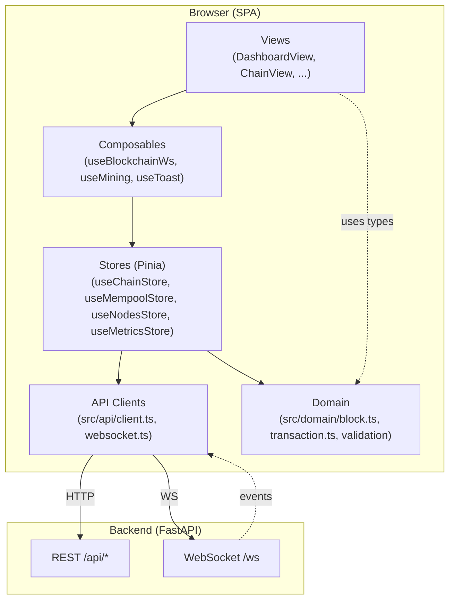
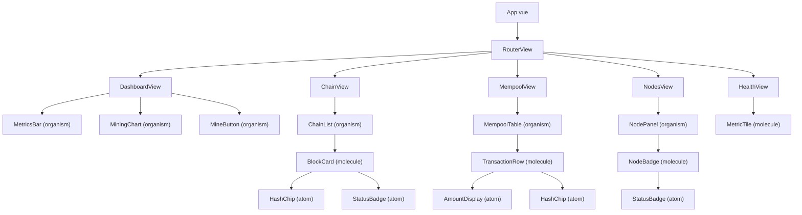
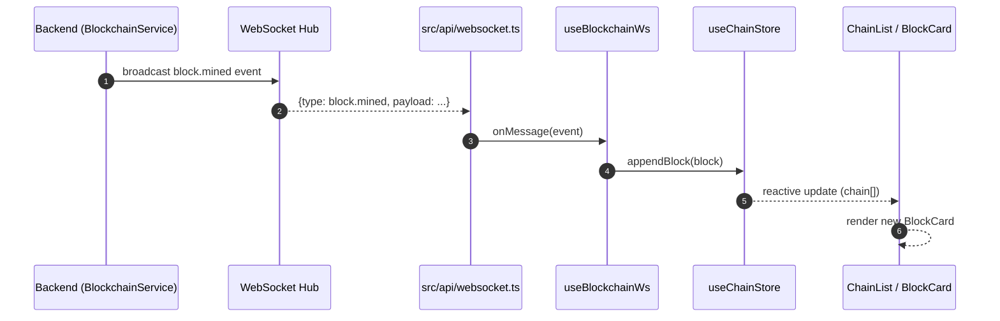
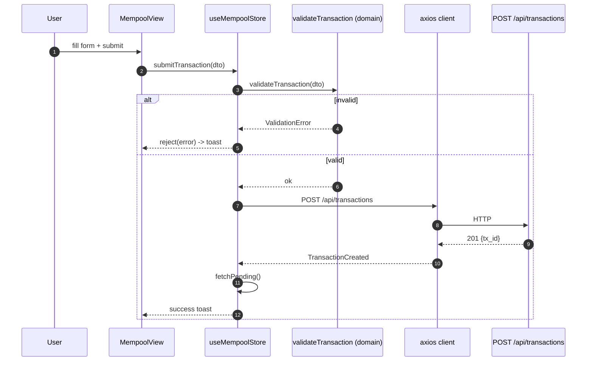
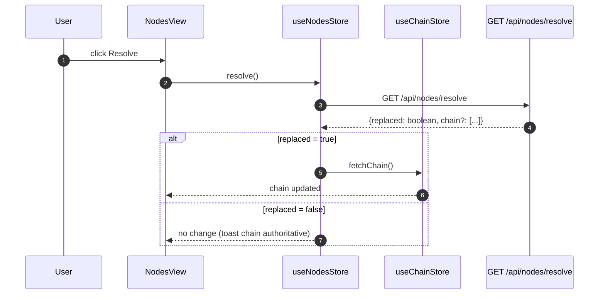
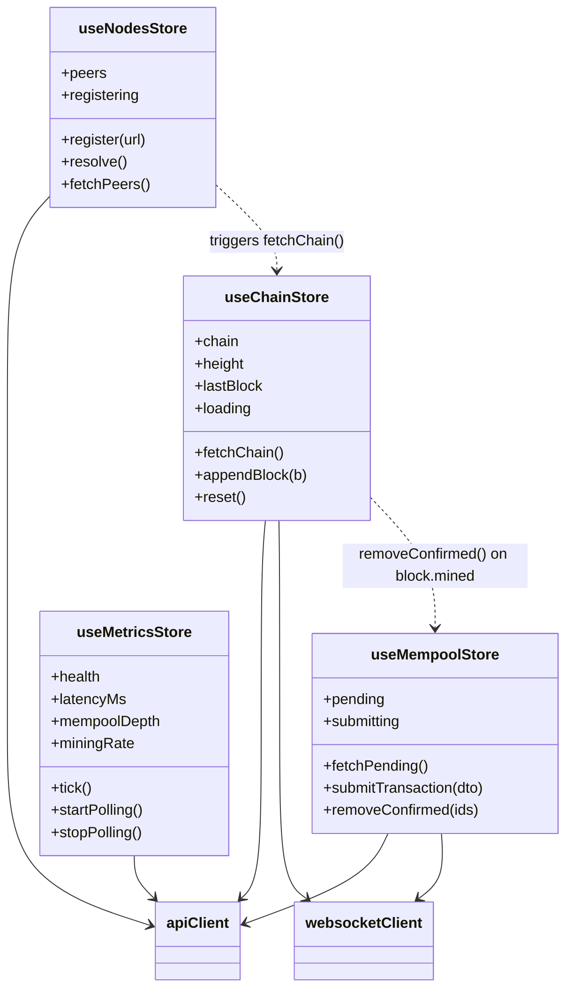
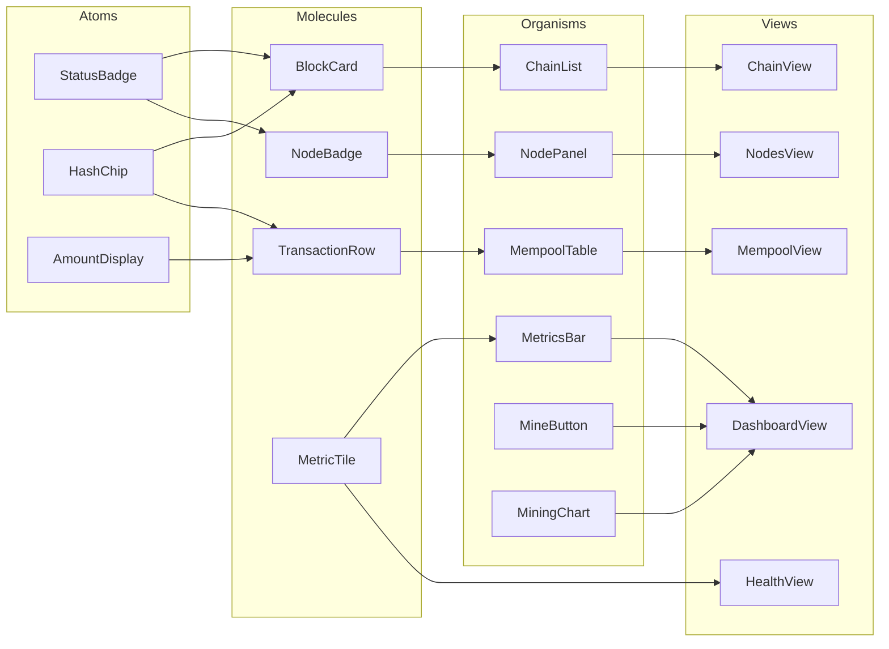
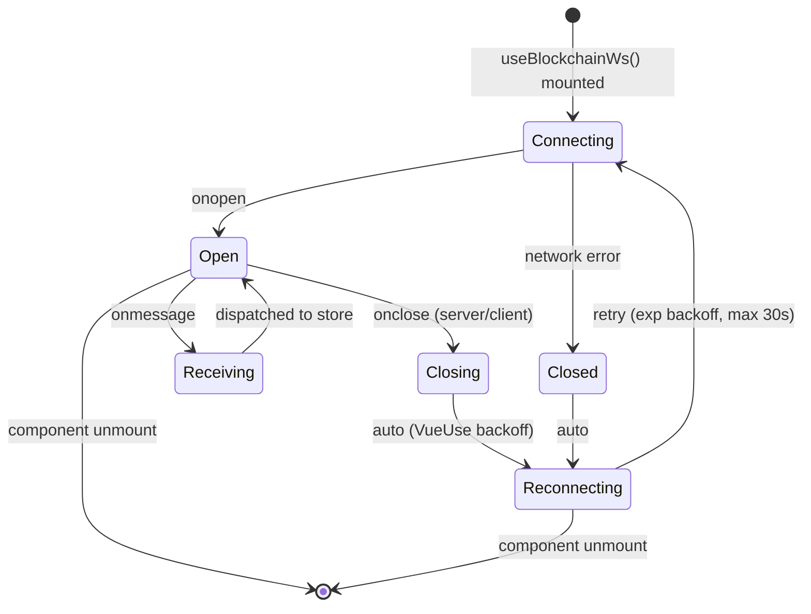

# Frontend Architecture — Basic Blockchain Simulator Dashboard

Status: Accepted
Last updated: 2026-04-24
Audience: Frontend engineers, tech leads, SRE, DevSecOps

---

## 1. Overview

### 1.1 Purpose

The **Basic Blockchain Frontend** is a real-time dashboard that visualises and
interacts with the [Basic Blockchain Simulator](../../basic-blockchain-simulator/) backend.
It provides:

- Live view of the canonical chain (blocks, transactions, metadata).
- Mempool monitoring with pending-transaction feed.
- Mining trigger with rate-limit awareness.
- Node-registry and consensus (longest-chain) visualisation.
- Health, metrics and latency telemetry.

The frontend is a **single-page application (SPA)** that communicates with the
backend through:

- **REST** (`/api/*`) for commands and queries.
- **WebSocket** (`/ws`) for chain and mempool change events.

### 1.2 Tech Stack

| Layer               | Technology           | Version | Role                                                     |
|---------------------|----------------------|---------|----------------------------------------------------------|
| Framework           | Vue                  | 3.x     | Reactive UI, Composition API                             |
| Build tool          | Vite                 | 6.x     | Dev server, HMR, production bundler                      |
| Language            | TypeScript           | 5.x     | Static types across domain, api, stores and components   |
| State               | Pinia                | 2.x     | Store-based state management                             |
| Utilities           | VueUse               | 11.x    | Composable primitives (useWebSocket, useIntervalFn, ...) |
| UI kit              | PrimeVue             | 4.x     | Accessible components (DataTable, Toast, Dialog, ...)    |
| Charts              | Chart.js             | 4.x     | Mining throughput, latency, mempool depth                |
| Routing             | Vue Router           | 4.x     | Client-side routing                                      |
| HTTP                | Axios                | 1.x     | REST client with interceptors                            |
| Tests               | Vitest + Vue TL      | 2.x     | Unit and component tests (>= 80% coverage)               |

### 1.3 Key Principle: Backend Mirroring

The frontend **deliberately mirrors the backend layering**:

```
backend/                      frontend/
api/           ------>        src/api/         (HTTP + WS clients)
domain/        ------>        src/domain/      (types, validation, pure logic)
persistence/                  (n/a — state in Pinia)
repository/    ------>        src/stores/      (reactive caches, actions)
```

This symmetry makes it trivial for a backend engineer to find the frontend
counterpart of any module and vice versa. Domain invariants (e.g. BR-TX-*) are
enforced both client-side (fast UX feedback) and server-side (authoritative).

---

## 2. Layered Architecture



**Rules:**

- Views never talk to `api/` directly — always through a store or composable.
- Stores are the only layer allowed to mutate client-side state.
- `domain/` is pure (no I/O), fully unit-testable, shared with `stores/` and views.
- `api/` converts DTOs to/from domain objects and normalises error envelopes.

---

## 3. Component Tree



---

## 4. Backend to Frontend Mapping

| Backend module                              | Frontend counterpart                                   | Notes                                                           |
|---------------------------------------------|--------------------------------------------------------|-----------------------------------------------------------------|
| `domain/models.py` (Block, Transaction)     | `src/domain/block.ts`, `src/domain/transaction.ts`     | TypeScript mirrors of Python dataclasses.                       |
| `domain/validation.py`                      | `src/domain/transaction.ts` (`validateTransaction`)    | Client-side BR-TX-* checks before POST.                         |
| `domain/blockchain.py` (`BlockchainService`) | `src/stores/chain.ts` (`useChainStore`)               | Holds canonical chain, height, last block.                      |
| `domain/mempool.py`                         | `src/stores/mempool.ts` (`useMempoolStore`)            | Pending tx list + submit action.                                |
| `domain/node_registry.py`                   | `src/stores/nodes.ts` (`useNodesStore`)                | Peer list, register/resolve actions.                            |
| `api/websocket_hub.py`                      | `src/api/websocket.ts` + `composables/useBlockchainWs` | VueUse `useWebSocket` with reconnection.                        |
| `api/rate_limit.py`                         | `src/components/organisms/MineButton.vue`              | Reads `Retry-After` header on HTTP 429 and disables button.     |
| `api/errors.py` (error envelope)            | `src/api/client.ts` (axios interceptor)                | Normalises `{code, message, details}` into typed `ApiError`.    |
| `scripts/serve_api.py` routes               | `src/api/endpoints.ts`                                 | Single source of truth for URL paths.                           |

---

## 5. Data Flow Diagrams

### 5.1 Block Mined (WebSocket push)



### 5.2 Transaction Submission



### 5.3 Consensus Resolve



---

## 6. State Management — Pinia Stores



**State responsibilities:**

- `useChainStore` — authoritative client-side mirror of the chain; listens to
  `block.mined` WS events and appends.
- `useMempoolStore` — pending transactions; reacts to `tx.added` and `tx.confirmed`.
- `useNodesStore` — peer registry + consensus trigger; may cascade into
  `useChainStore.fetchChain()` on chain replacement.
- `useMetricsStore` — polled every 5 s via `useIntervalFn`; powers `MetricsBar`
  and `MiningChart`.

---

## 7. Atomic Design Hierarchy



**Hard rules:**

- Atoms have **no dependencies on stores** — pure presentational, props in, emits out.
- Molecules may compose atoms but still no store access.
- Organisms are the **first layer allowed to call useXxxStore()**.
- Views orchestrate organisms and routing params.

---

## 8. WebSocket Connection Lifecycle



- Reconnection is handled by VueUse `useWebSocket` with `autoReconnect`
  (retries: Infinity, delay: 1000, exponential).
- On each reconnect `useChainStore.fetchChain()` is called to reconcile any
  events missed while offline (idempotent; backend returns canonical chain).

---

## 9. Environment Configuration

| Variable              | Default (dev)              | Default (prod)         | Purpose                                    |
|-----------------------|----------------------------|------------------------|--------------------------------------------|
| `VITE_API_BASE_URL`   | `/api` (via Vite proxy)    | `https://host/api`     | Base URL for REST calls.                   |
| `VITE_WS_URL`         | `ws://localhost:5173/ws`   | `wss://host/ws`        | WebSocket endpoint.                        |
| `VITE_POLL_INTERVAL`  | `5000`                     | `5000`                 | Metrics polling period (ms).               |
| `VITE_LOG_LEVEL`      | `debug`                    | `warn`                 | Console log verbosity.                     |
| `VITE_APP_VERSION`    | from `package.json`        | from `package.json`    | Displayed in footer; injected at build.    |

Override via `.env.local` (dev) or runtime `window.__ENV__` (prod, injected by
container entrypoint). See `src/config/env.ts`.

---

## 10. CI/CD Pipeline

### 10.1 ci.yml — pull request + push

```
install  ->  lint  ->  typecheck  ->  test (coverage >= 80%)  ->  build  ->  audit
```

- `install` — `npm ci` with cache key `package-lock.json`.
- `lint` — ESLint + Prettier check.
- `typecheck` — `vue-tsc --noEmit`.
- `test` — Vitest with `--coverage` (thresholds: 80% lines/branches/functions).
- `build` — `vite build`; artifact uploaded.
- `audit` — `npm audit --omit=dev --audit-level=high`.

### 10.2 sast.yml — security scans

- Runs on pushes to `develop` and `main`, and weekly.
- **Semgrep** with `p/owasp-top-ten` and `p/javascript` rulesets.
- **CodeQL** for JavaScript/TypeScript.
- Fails the build on any high-severity finding.

### 10.3 release.yml — tag-triggered

- Triggered by `push` of a tag matching `v*`.
- Builds production artifact, generates `CHANGELOG.md` delta, creates GitHub
  release with the build zipped, and publishes a Docker image tagged with the
  SemVer version.
- Annotated tags only (`git tag -a vX.Y.Z -m "..."`).

---

## 11. Design Decisions (ADR summary)

Full ADRs live under `decisions/`.

| ID      | Title                                     | Rationale (short)                                                                                       |
|---------|-------------------------------------------|---------------------------------------------------------------------------------------------------------|
| ADR-001 | Vue 3 over React                          | Reactivity model fits real-time chain state; single-file components keep presentational+logic cohesive. |
| ADR-002 | Pinia over Vuex / Tanstack Query          | Simpler TypeScript inference, Composition-API native, ergonomic for both sync stores and async actions. |
| ADR-003 | Atomic Design                             | Scales from PoC to production without structural rewrites; clear testing boundaries per layer.          |
| -       | VueUse useWebSocket                       | Built-in reconnection with backoff eliminates hand-rolled retry logic and its edge cases.               |
| -       | Vite dev proxy for /api and /ws           | Avoids CORS in development; production uses same-origin reverse proxy.                                  |
| -       | Client-side validation mirroring BR-TX-*  | Instant user feedback without a round-trip; backend remains authoritative.                              |
| -       | PrimeVue as UI kit                        | Accessible, themeable, batteries-included DataTable/Toast/Dialog.                                       |
| -       | Chart.js over D3                          | Zero-config for the chart set we need (line/bar); lower bundle cost than D3.                            |

---

## 12. Repository Layout (target)

```
basic-blockchain-frontend/
  docs/
    architecture.md        (this file)
    components.md
    index.md
    decisions/
      ADR-001-vue-over-react.md
      ADR-002-pinia-state.md
      ADR-003-atomic-design.md
  src/
    api/              (client.ts, websocket.ts, endpoints.ts)
    domain/           (block.ts, transaction.ts, validation.ts, node.ts)
    stores/           (chain.ts, mempool.ts, nodes.ts, metrics.ts)
    composables/      (useBlockchainWs.ts, useMining.ts, useToast.ts)
    components/
      atoms/
      molecules/
      organisms/
    views/
    router/
    config/
    App.vue
    main.ts
  tests/
    unit/
    component/
  public/
  .env.example
  vite.config.ts
  tsconfig.json
  package.json
  README.md
```

---

## 13. References

- Backend architecture: `../../basic-blockchain-simulator/docs/architecture.md`
- Backend API reference: `../../basic-blockchain-simulator/docs/api-reference.md`
- Backend business rules: `../../basic-blockchain-simulator/docs/business-rules.md`
- Vue 3: https://vuejs.org/
- Pinia: https://pinia.vuejs.org/
- VueUse: https://vueuse.org/
- PrimeVue: https://primevue.org/
