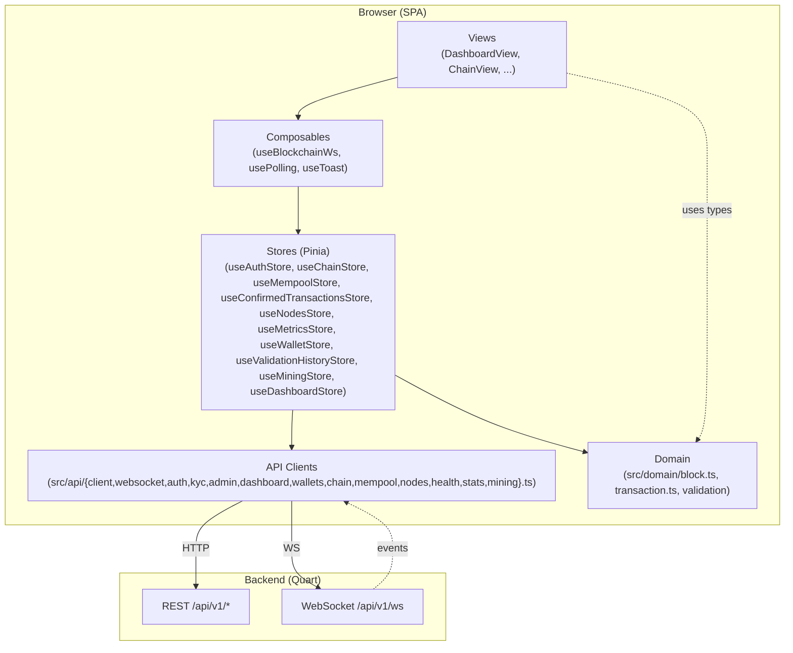
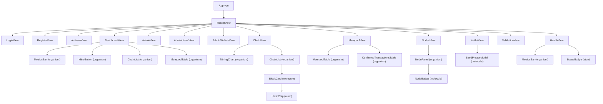
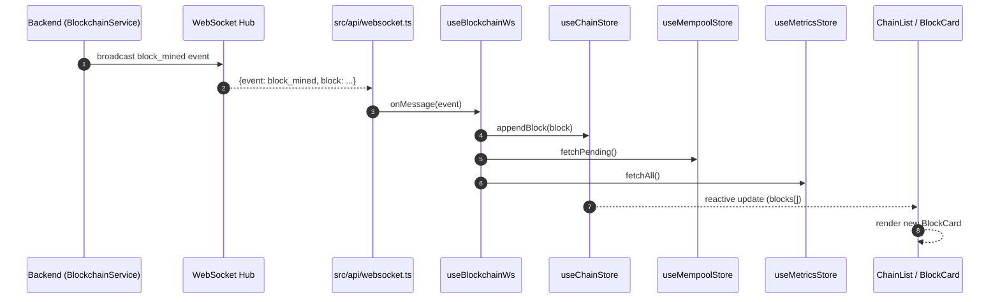
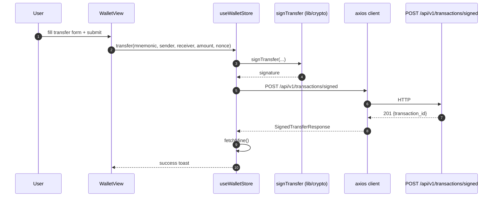
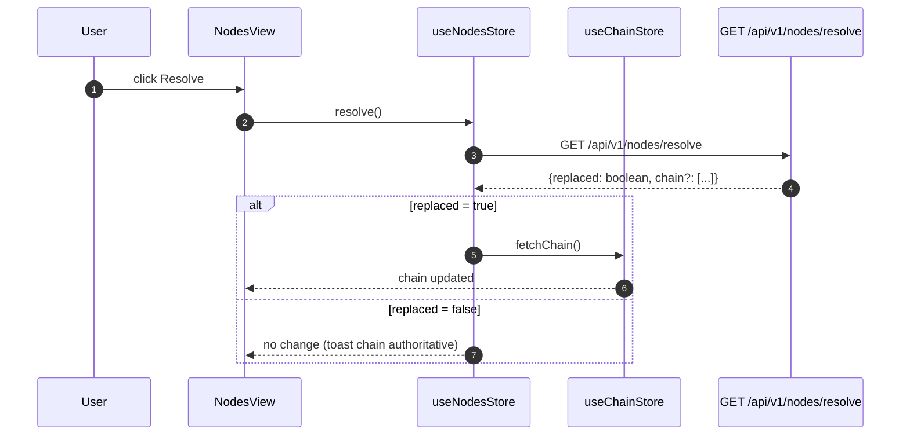
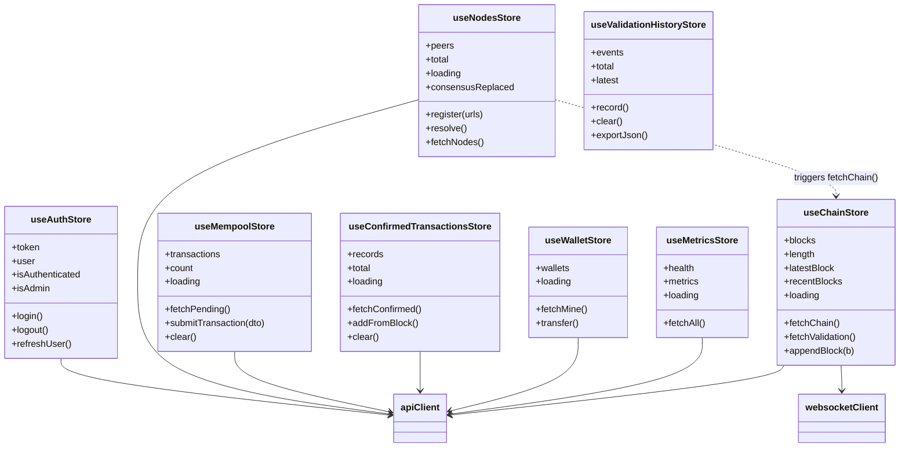
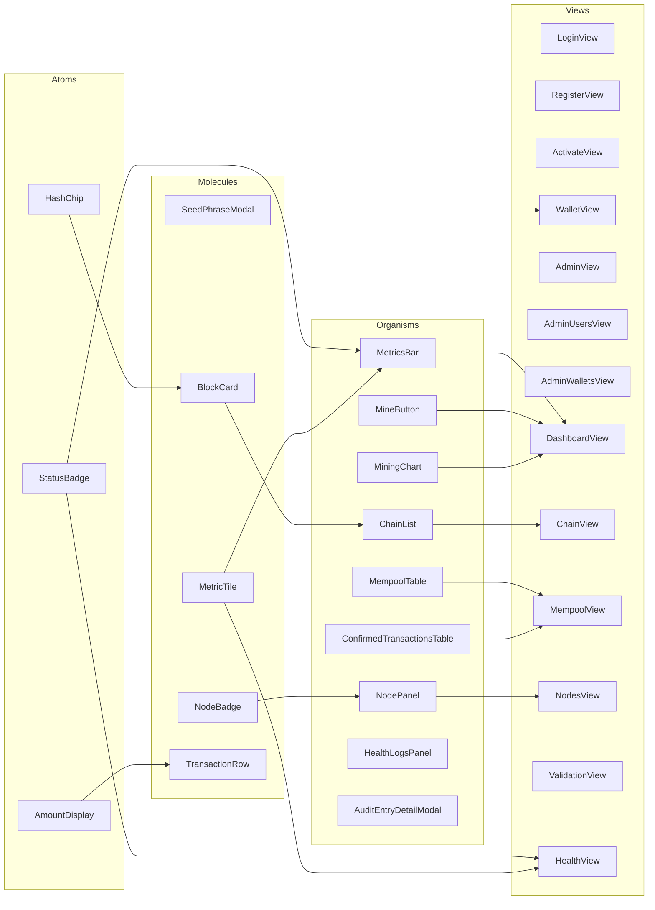
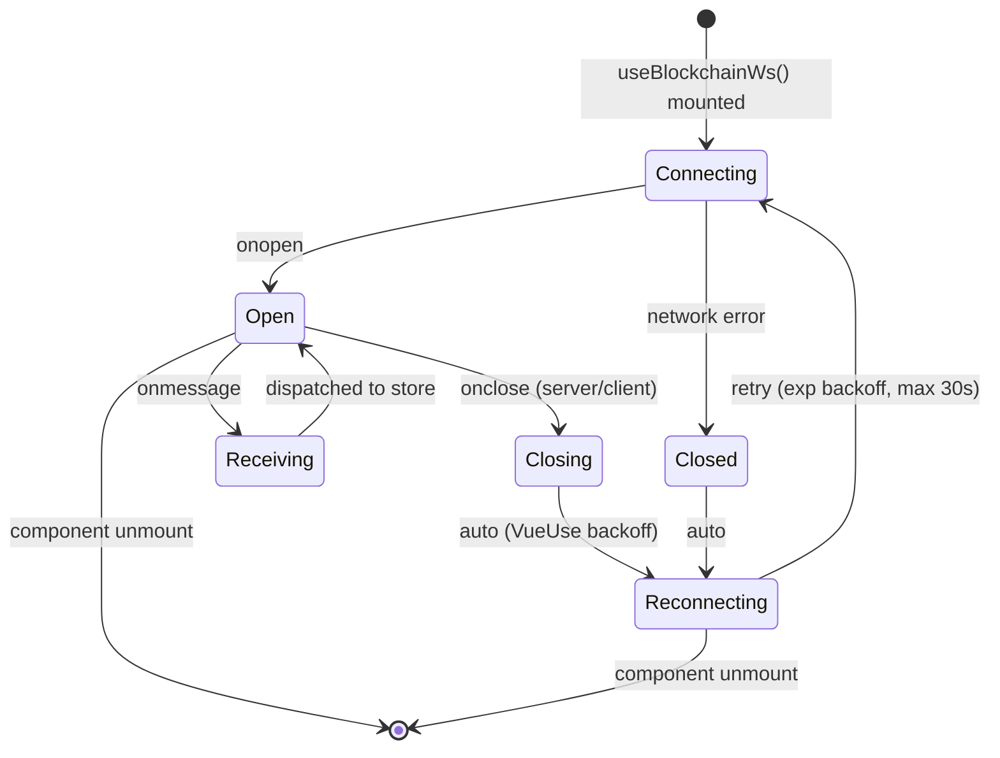

# Frontend Architecture — Basic Blockchain Simulator Dashboard

Status: Accepted
Last updated: 2026-05-29 (Phase 7 closed — Design v2 + Atomic migration shipped in v0.9.0)
Audience: Frontend engineers, tech leads, SRE, DevSecOps

---

## 1. Overview

### 1.1 Purpose

The **Basic Blockchain Frontend** is a real-time dashboard that visualises and
interacts with the [Basic Blockchain Simulator](../../basic-blockchain-simulator/) backend.
It provides:

- Live view of the canonical chain (blocks, transactions, metadata).
- Mempool monitoring with pending and confirmed history.
- Mining trigger with chain and mempool refresh.
- Node-registry and consensus (longest-chain) visualisation.
- Health, metrics and latency telemetry.
- JWT authentication and session-aware routing.
- Wallet management with BIP-39 mnemonic flow and signed transfers.
- Admin workflows (users, wallets, minting, currencies, exchange rates,
  audit log, KYC review, dashboard analytics).
- Treasury distribution with dual-sign approval (Phase 7.8).
- Multi-currency support with FX-as-of-timestamp aggregation (Phase 6e/6i).
- Design System v2 (Phase 7) — unified Base\* atom layer driving every
  view, drawer and flow. See [`DESIGN-v2.md`](./DESIGN-v2.md).

The frontend is a **single-page application (SPA)** that communicates with the
backend through:

- **REST** (`/api/v1/*`) for commands and queries.
- **WebSocket** (`/api/v1/ws`) for chain change events.

### 1.2 Tech Stack

| Layer      | Technology      | Version | Role                                                   |
| ---------- | --------------- | ------- | ------------------------------------------------------ |
| Framework  | Vue             | 3.5     | Reactive UI, Composition API                           |
| Build tool | Vite            | 6.x     | Dev server, HMR, production bundler                    |
| Language   | TypeScript      | 5.x     | Static types across domain, api, stores and components |
| State      | Pinia           | 2.x     | Store-based state management                           |
| Utilities  | VueUse          | 11.x    | Composable primitives (useWebSocket, usePolling, ...)  |
| UI kit     | PrimeVue        | 4.x     | Accessible components (DataTable, Toast, Dialog, ...)  |
| Charts     | Chart.js        | 4.x     | Mining throughput, latency, mempool depth              |
| Charts (v2)| ECharts (vue-echarts) | 5.x | Volume / dashboard charts (lazy-loaded, modular)     |
| Routing    | Vue Router      | 4.x     | Client-side routing                                    |
| HTTP       | Axios           | 1.x     | REST client with interceptors                          |
| Tests      | Vitest + Vue TL | 2.x     | Unit and component tests (>= 80% coverage)             |

### 1.3 Key Principle: Backend Mirroring

The frontend **deliberately mirrors the backend layering**:

```
backend/                      frontend/
api/           ------>        src/api/         (HTTP + WS clients)
domain/        ------>        src/domain/      (types, validation, pure logic)
persistence/                  (n/a — state in Pinia)
repository/    ------>        src/stores/      (reactive caches, actions)
```

This symmetry makes it trivial for a backend engineer to find the frontend
counterpart of any module and vice versa. Domain invariants (e.g. BR-TX-\*) are
enforced both client-side (fast UX feedback) and server-side (authoritative).

### 1.4 Component layer (post-Phase 7)

The UI layer follows **Atomic Design** ([ADR-003](decisions/ADR-003-atomic-design.md))
on top of the **Design v2** contract ([DESIGN-v2.md](DESIGN-v2.md)):

```
atoms       — Base{Button,Badge,Card,Table,Modal,Drawer}, Stepper,
              HashChip, AmountDisplay
molecules   — AuthLayout, BlockCard, TransactionRow, MetricTile, …
organisms   — ChainList, MempoolTable, MetricsBar, PaginatedTable,
              HealthLogsPanel, AuditEntryDetailModal, …
flows       — TreasuryApprovalFlow (dual-sign), KYCReviewFlow,
              SendConfirmFlow, ExchangeOrderFlow, …
drawers     — UserDrawer, WalletDrawer, ProfileDrawer (all built on
              BaseDrawer)
views       — every screen migrated to the Base\* atoms in Phase 7.2–7.9
```

A snapshot matrix per Base\* atom guards visual regressions
(`tests/components/__snapshots__/`).

### 1.5 API surface

The full HTTP / WS catalog the SPA consumes is documented in
[`api-reference.md`](./api-reference.md) and mirrored in
[`postman/basic-blockchain.postman_collection.json`](./postman/basic-blockchain.postman_collection.json).
Major additions since Phase 5:

- **Auth + KYC**: `/auth/*`, `/me/kyc/*`, admin `/admin/kyc/*`.
- **Dashboard analytics**: `/admin/stats?compare=`, `/admin/volume`,
  `/admin/movements/top`, `/admin/audit?severity=&since=`.
- **Treasury**: `/admin/treasury`, `/admin/treasury/distribute[/:opId/{approve,cancel}]`.
- **Exchange rates**: `/admin/exchange-rates[/:from/:to|/sync]`.
- **Currencies**: public `/currencies` + admin `/admin/currencies`.

---

## 2. Layered Architecture



**Rules:**

- Views never talk to `api/` directly — always through a store or composable.
- Stores are the only layer allowed to mutate client-side state.
- `domain/` is pure (no I/O), fully unit-testable, shared with `stores/` and views.
- `api/` converts DTOs to/from domain objects and normalises error envelopes.

---

## 3. Component Tree



---

## 4. Backend to Frontend Mapping

| Backend module                               | Frontend counterpart                                           | Notes                                               |
| -------------------------------------------- | -------------------------------------------------------------- | --------------------------------------------------- |
| `domain/models.py` (Block, Transaction)      | `src/domain/block.ts`, `src/domain/transaction.ts`             | TypeScript mirrors of Python dataclasses.           |
| `domain/validation.py`                       | `src/domain/transaction.ts` (`validateTransaction`)            | Client-side BR-TX-\* checks before POST.            |
| `domain/blockchain.py` (`BlockchainService`) | `src/stores/chain.ts` (`useChainStore`)                        | Holds canonical chain, height, last block.          |
| `domain/mempool.py`                          | `src/stores/mempool.ts`, `src/stores/confirmedTransactions.ts` | Pending list + confirmed history.                   |
| `domain/node_registry.py`                    | `src/stores/nodes.ts` (`useNodesStore`)                        | Peer list, register/resolve actions.                |
| `api/auth_routes.py`                         | `src/api/auth.ts`, `src/stores/auth.ts`                        | JWT login, session storage, role checks.            |
| `api/wallet_routes.py`                       | `src/api/wallets.ts`, `src/stores/wallet.ts`                   | Wallet CRUD + signed transfer submission.           |
| `api/admin_routes.py`                        | `src/api/admin.ts`, `src/views/Admin*.vue`                     | Admin workflows (users, wallets, mint).             |
| `api/websocket_hub.py`                       | `src/api/websocket.ts` + `composables/useBlockchainWs`         | VueUse `useWebSocket` with reconnection.            |
| `api/errors.py` (error envelope)             | `src/api/client.ts` (axios interceptor)                        | Normalises `{code, message}` into typed `ApiError`. |
| `GET /health` → `components[]`               | `src/api/health.ts → getHealth()`                              | Maps snake_case `components` array to `ComponentStatus[]`; field is optional — fallback static rows shown in HealthView when absent |

---

## 5. Data Flow Diagrams

### 5.1 Block Mined (WebSocket push)



### 5.2 Transaction Submission



### 5.3 Consensus Resolve



---

## 6. State Management — Pinia Stores



**State responsibilities:**

- `useAuthStore` — JWT session persistence, role checks, and profile refresh.
- `useChainStore` — authoritative chain mirror; appends on `block_mined` WS events.
- `useMempoolStore` — pending transactions; refreshed on demand and on block mined.
- `useConfirmedTransactionsStore` — confirmed transaction history from `/api/v1/transactions`.
- `useNodesStore` — peer registry + consensus trigger; may cascade into
  `useChainStore.fetchChain()` on chain replacement.
- `useMetricsStore` — fetched on demand and after block mined; powers `MetricsBar`
  and `MiningChart`.
- `useWalletStore` — wallet list + signed transfer submission.
- `useValidationHistoryStore` — client-side validation history export.

**Domain types (relevant additions):**

- `ComponentStatus` (`src/domain/metrics.ts`) — per-subsystem health item returned by `GET /health components[]`. Fields: `id`, `label`, `meta?`, `status`.
- `Health.components?: ComponentStatus[]` — optional field added to `Health`; absent when backend hasn't shipped the feature yet.

---

## 7. Atomic Design Hierarchy



**Hard rules:**

- Atoms have **no dependencies on stores** — pure presentational, props in, emits out.
- Molecules may compose atoms but still no store access.
- Organisms are the **first layer allowed to call useXxxStore()**.
- Views orchestrate organisms and routing params.

---

## 8. WebSocket Connection Lifecycle



- Reconnection is handled by VueUse `useWebSocket` with `autoReconnect`
  (retries: 10, delay: 3000).
- On each `block_mined` message, `useBlockchainWs` appends the block and
  refreshes mempool + metrics.

---

## 9. Environment Configuration

| Variable            | Default (dev) | Default (prod) | Purpose                             |
| ------------------- | ------------- | -------------- | ----------------------------------- |
| `VITE_API_BASE_URL` | `/api/v1`     | `/api/v1`      | Base URL for REST calls.            |
| `VITE_WS_URL`       | derived       | derived        | WebSocket URL (falls back to host). |

Override via `.env.local` (dev) or environment injection at build time.

---

## 10. CI/CD Pipeline

### 10.1 ci.yml — pull request + push

```
install  ->  lint  ->  typecheck  ->  test (coverage >= 80%)  ->  build  ->  audit
```

- `install` — `npm ci` with cache key `package-lock.json`.
- `lint` — ESLint + Prettier check.
- `typecheck` — `vue-tsc --noEmit`.
- `test` — Vitest with `--coverage` (thresholds: 80% lines/branches/functions).
- `build` — `vite build`; artifact uploaded.
- `audit` — `npm audit --omit=dev --audit-level=high`.

### 10.2 sast.yml — security scans

- Runs on pushes to `develop` and `main`, and weekly.
- **Semgrep** with `p/owasp-top-ten` and `p/javascript` rulesets.
- **CodeQL** for JavaScript/TypeScript.
- Fails the build on any high-severity finding.

### 10.3 release.yml — tag-triggered

- Triggered by `push` of a tag matching `v*`.
- Builds production artifact, generates `CHANGELOG.md` delta, creates GitHub
  release with the build zipped, and publishes a Docker image tagged with the
  SemVer version.
- Annotated tags only (`git tag -a vX.Y.Z -m "..."`).

---

## 11. Design Decisions (ADR summary)

Full ADRs live under `decisions/`.

| ID      | Title                                     | Rationale (short)                                                                                       |
| ------- | ----------------------------------------- | ------------------------------------------------------------------------------------------------------- |
| ADR-001 | Vue 3 over React                          | Reactivity model fits real-time chain state; single-file components keep presentational+logic cohesive. |
| ADR-002 | Pinia over Vuex / Tanstack Query          | Simpler TypeScript inference, Composition-API native, ergonomic for both sync stores and async actions. |
| ADR-003 | Atomic Design                             | Scales from PoC to production without structural rewrites; clear testing boundaries per layer.          |
| -       | VueUse useWebSocket                       | Built-in reconnection with backoff eliminates hand-rolled retry logic and its edge cases.               |
| -       | Vite dev proxy for /api/v1 and /api/v1/ws | Avoids CORS in development; production uses same-origin reverse proxy.                                  |
| -       | Client-side validation mirroring BR-TX-\* | Instant user feedback without a round-trip; backend remains authoritative.                              |
| -       | PrimeVue as UI kit                        | Accessible, themeable, batteries-included DataTable/Toast/Dialog.                                       |
| -       | Chart.js over D3                          | Zero-config for the chart set we need (line/bar); lower bundle cost than D3.                            |

---

## 12. Repository Layout (target)

```
basic-blockchain-frontend/
  docs/
    architecture.md        (this file)
    components.md
    index.md
    decisions/
      ADR-001-vue-over-react.md
      ADR-002-pinia-state.md
      ADR-003-atomic-design.md
  src/
    api/              (client.ts, websocket.ts, auth.ts, wallets.ts, admin.ts)
    domain/           (block.ts, transaction.ts, validation.ts, node.ts)
    stores/           (auth.ts, chain.ts, mempool.ts, confirmedTransactions.ts, nodes.ts, metrics.ts, wallet.ts)
    composables/      (useBlockchainWs.ts, usePolling.ts, useToast.ts)
    components/
      atoms/
      molecules/
      organisms/
    views/
    router/
    App.vue
    main.ts
  tests/
    unit/
    component/
  public/
  .env.example
  vite.config.ts
  tsconfig.json
  package.json
  README.md
```

---

## 13. References

- Backend architecture: `../../basic-blockchain-simulator/docs/architecture.md`
- Backend API reference: `../../basic-blockchain-simulator/docs/api-reference.md`
- Backend business rules: `../../basic-blockchain-simulator/docs/business-rules.md`
- Vue 3: https://vuejs.org/
- Pinia: https://pinia.vuejs.org/
- VueUse: https://vueuse.org/
- PrimeVue: https://primevue.org/
